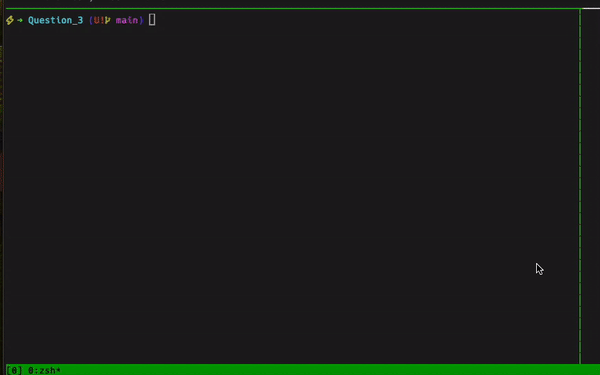

# Question_3: API
### How to run it
1. Run docker-compose to start the API

If you dont have docker-compose installed:
For Mac OS 
```sh
brew install docker-compose
```

For Linux  OS 
```sh
sudo apt update
sudo apt install docker-compose
```

For Windows OS
```sh
https://docs.docker.com/compose/install/
```

Go inside the Question_3/ folder and run the following:
```sh
docker-compose up --build -d
```
This will build the Dockerfile that wraps the main.py file and will run it in the background.

Your API is ready to some testing
Run the following command to test the API
```sh
curl -X GET "http://localhost:5000/greet"
```
Then run:
```sh
curl -X GET "http://localhost:5000/greet?name=Camilo"
```



### Description and directory  structure 
```sh
├── Dockerfile
├── README.md
├── __init__.py
├── docker-compose.yaml
├── main.py
├── media
│   └── api.gif
├── requirements.txt
└── schemas
    ├── __init__.py
    ├── __pycache__
    └── schemas_greet.py

4 directories, 9 files
```

### Requirements.txt
```sh
annotated-types==0.7.0
blinker==1.9.0
click==8.1.7
Flask==3.1.0
Flask-Pydantic==0.12.0
itsdangerous==2.2.0
Jinja2==3.1.4
MarkupSafe==3.0.2
pydantic==2.10.3
pydantic_core==2.27.1
typing_extensions==4.12.2
Werkzeug==3.1.3
```

## Some considerations 

For this simple API I decided to use Flask and Pydantic to validate the input.
When the API request is made, the input is validated by the Pydantic schema and if the input is not valid, the API will return a 404 status code not found the URL.
